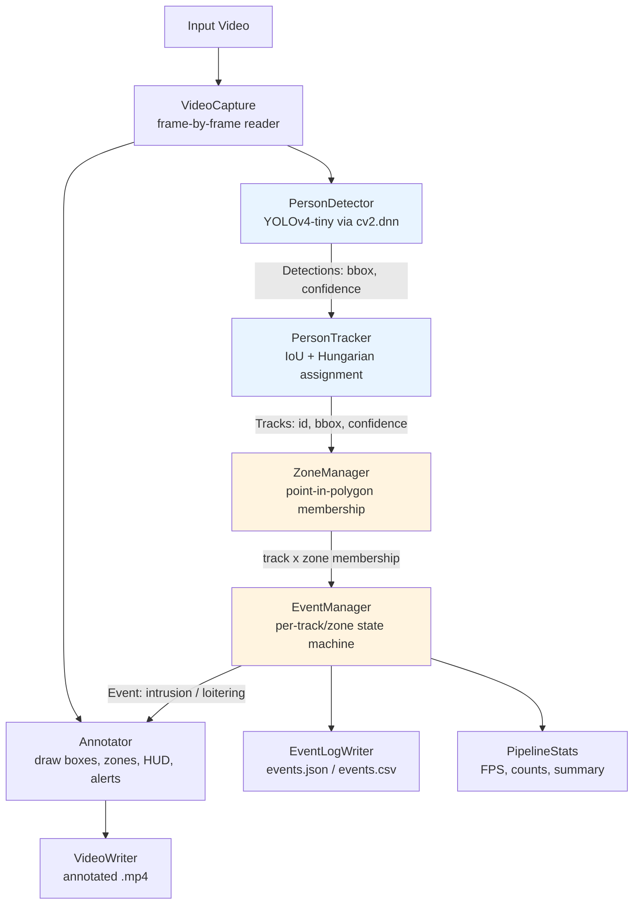
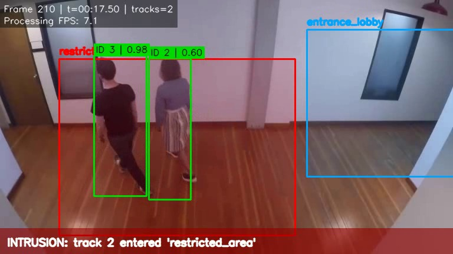

# Video Surveillance AI — Detection, Tracking & Event Recognition

**Quanteon Solutions AI Engineer Take-Home Assignment**

A CPU-friendly, dependency-light pipeline that detects people in security
camera footage, tracks them across frames with persistent IDs, and raises
timestamped **zone intrusion** and **loitering** events against
configurable polygon zones — with an annotated output video and
structured JSON/CSV event logs.

---

## Table of Contents

1. [Problem Statement](#1-problem-statement)
2. [Features](#2-features)
3. [Architecture Overview](#3-architecture-overview)
4. [Architecture Diagram](#4-architecture-diagram)
5. [Pipeline Flow](#5-pipeline-flow)
6. [Model Selection](#6-model-selection)
7. [Detector](#7-detector)
8. [Tracker](#8-tracker)
9. [Re-Identification Approach](#9-re-identification-approach)
10. [Zone Detection Logic](#10-zone-detection-logic)
11. [Intrusion Logic](#11-intrusion-logic)
12. [Loitering Logic](#12-loitering-logic)
13. [Event Deduplication](#13-event-deduplication)
14. [Configuration](#14-configuration)
15. [Installation](#15-installation)
16. [Requirements](#16-requirements)
17. [Usage / CLI Examples](#17-usage--cli-examples)
18. [Sample Output](#18-sample-output)
19. [Event Log Examples](#19-event-log-examples)
20. [Performance](#20-performance)
21. [CPU / GPU Notes](#21-cpu--gpu-notes)
22. [Edge Cases](#22-edge-cases)
23. [Known Limitations](#23-known-limitations)
24. [Future Improvements](#24-future-improvements)
25. [Project Structure](#25-project-structure)
26. [Testing](#26-testing)
27. [Reproducibility](#27-reproducibility)
28. [Dataset / Video Sources](#28-dataset--video-sources)

---

## 1. Problem Statement

Build a system that processes security camera footage to detect people,
track them across frames, and identify events of interest — specifically
**zone intrusion** and **loitering** — with production-minded engineering
(modularity, error handling, configuration, reproducibility) rather than
a research prototype chasing benchmark accuracy.

## 2. Features

- Person detection with bounding boxes + confidence scores (YOLOv4-tiny)
- Multi-object tracking with persistent IDs, tolerant of brief occlusion
- Polygon-based, JSON-configurable zones (any number, convex or concave)
- Zone intrusion detection (edge-triggered, deduplicated)
- Loitering detection with a configurable per-zone time threshold
- Timestamped, structured JSON **and** CSV event logs
- Annotated output video: boxes, IDs, confidence, zone overlays, HUD, alerts
- Full CLI with 15+ configurable options
- Automatic CPU/CUDA device selection with graceful fallback
- Streaming, frame-by-frame processing (flat memory usage on long videos)
- FPS benchmarking (video FPS vs. processing FPS)
- 53 unit tests covering geometry, state machines, and config validation
- Honest evaluation scaffold for MOT-format ground truth (precision/recall/F1/ID-switches)

## 3. Architecture Overview

The pipeline is a straight-line, single-pass frame processor with five
independently testable stages, each in its own module:

```
video frame -> [Detector] -> [Tracker] -> [ZoneManager + EventManager] -> [Annotator] -> [Writers]
```

Every stage takes and returns plain, framework-agnostic data (`Detection`,
`Track`, `Event` dataclasses) — no stage imports another stage's
internals, only these shared types. This is what makes the modules
independently unit-testable (see `tests/`), and what makes it easy to
swap the detector or tracker later without touching zone/event logic.

## 4. Architecture Diagram



## 5. Pipeline Flow

`src/pipeline.py`'s `SurveillancePipeline.run()` does the following, once
per frame, until the video ends:

1. Read one frame (`cv2.VideoCapture.read()`) — never the whole video into memory.
2. `PersonDetector.detect(frame)` → list of `Detection(bbox, confidence)`.
3. `PersonTracker.update(detections)` → list of confirmed `Track(id, bbox, ...)`.
4. For each track, `ZoneManager.zones_containing(bbox)` → which zones (if any) it's in.
5. `EventManager.process_frame(...)` advances each `(track_id, zone)` state
   machine and returns any newly-fired `Event`s this frame.
6. If enabled, annotate the frame (boxes/IDs/zones/HUD/alerts) and write it
   to the output video.
7. Every `--fps-log-interval` frames, log a progress/FPS line.
8. At end-of-stream: flush JSON/CSV event logs and print the summary block
   (video FPS, processing FPS, frame/detection/event counts, elapsed time).

## 6. Model Selection

### Detector: YOLOv4-tiny (via OpenCV `cv2.dnn`, Darknet weights)

| Option considered | Verdict | Why |
|---|---|---|
| **YOLOv4-tiny (chosen)** | ✅ | One-stage, purpose-built for real-time detection; runs through `cv2.dnn` with **zero PyTorch/CUDA-toolkit dependency**; ~23MB weights; COCO-pretrained `person` class; good CPU throughput. |
| YOLOv8 (ultralytics) | ❌ not used here | Would be the first choice on a machine with a working PyTorch/CUDA install — cleaner API, built-in ByteTrack via `model.track()`, generally higher mAP than v4-tiny. Not used in *this* build because installing PyTorch's CUDA-bundled wheel exhausted the build sandbox's disk quota (multi-GB `nvidia-*` packages) — see "Known Limitations". The codebase is structured so swapping in an ONNX-exported YOLOv8n through `cv2.dnn.readNetFromONNX` is a small, contained change to `detector.py` alone. |
| Faster R-CNN | ❌ | Two-stage detector: notably more accurate on small/occluded objects but 5-10x slower on CPU and requires a much heavier framework (Detectron2/torchvision) — wrong trade-off for a system meant to run acceptably on a reviewer's CPU-only laptop. |
| Full YOLOv4 (non-tiny) | ❌ (but supported) | Higher accuracy, ~3-4x slower than tiny on CPU. `--model` lets you swap it in if accuracy matters more than speed for your footage. |
| HOG+SVM (classic) | ❌ | Zero extra dependencies (built into OpenCV) but meaningfully worse accuracy on modern footage (lighting, pose, partial occlusion) than any CNN detector; considered as a bottom-line fallback, rejected because it would misrepresent this as a "modern lightweight detector" per the assignment. |

**Speed vs. accuracy**: YOLOv4-tiny trades the ~10-15% mAP that full
YOLOv4/YOLOv8 would give you (on COCO `person`) for roughly a 5-8x
CPU speedup and a fraction of the memory footprint. For a surveillance
system that needs to keep up with real video streams on commodity
hardware — and where the assignment explicitly says perfect accuracy is
not the bar — this is the right side of the trade-off.

**Pre-trained vs. fine-tuned**: The assignment scope (8-10 hours, no
training pipeline requirement) and "must work with a pre-trained model"
requirement both point at using COCO-pretrained weights as-is. Fine-tuning
on VIRAT/MOT17/UCF-Crime-specific camera angles and lighting *would*
improve accuracy further, and is called out under "Future Improvements",
but was correctly out of scope here.

### Tracker: Custom IoU/Hungarian tracker

See [Tracker](#8-tracker) below for full detail. In short: **not** the
official `bytetrack`/`deep-sort-realtime` PyPI packages (both pull in
either PyTorch or a large dependency tree), but a from-scratch
implementation of the same core algorithm (constant-velocity motion
prediction + Hungarian IoU assignment + lost-track buffering) using only
`numpy`/`scipy`, which are already required by the detector's NMS path.

| Option considered | Verdict | Why |
|---|---|---|
| **Custom IoU/Hungarian tracker (chosen)** | ✅ | Uses constant-velocity motion prediction, IoU-based cost, and Hungarian assignment; no extra heavy dependency; fully unit-testable in isolation (`tests/test_tracker.py`); explicit `max_age`/`min_hits`/`iou_threshold` knobs exposed on the CLI. |
| DeepSORT | ❌ | Adds a learned appearance-embedding CNN (re-ID network) on top of Kalman+IoU tracking. Meaningfully better at surviving long occlusions and crowded-scene ID swaps, but requires a second neural network and (typically) a PyTorch/TensorFlow runtime. Explicitly noted as the natural upgrade path — see "Re-Identification Approach". |
| Official ByteTrack | ❌ not used here | Uses a different two-stage association strategy based on high- and low-confidence detections. It is a natural upgrade path for stronger tracking in crowded scenes, but is intentionally not included in this lightweight dependency-free implementation. |
| Centroid-distance tracker | ❌ | Simpler, but IoU is a strictly better association signal for bounding boxes of varying size/aspect ratio (centroid distance alone confuses nearby people of different sizes). |

## 7. Detector

`src/detector.py` — `PersonDetector`:

- Loads a Darknet `.cfg`/`.weights` pair via `cv2.dnn.readNetFromDarknet`.
- Builds a 416×416 blob (configurable via `--input-size`), runs a forward
  pass, filters to COCO class 0 (`person`) above `--confidence`, and
  applies `cv2.dnn.NMSBoxes` at `--iou`.
- Returns `[]` (never raises) on a frame with no detections — "no
  detections" is a normal outcome, not an error condition.
- Device selection is handled here (see [CPU/GPU Notes](#21-cpu--gpu-notes)).
- Constructor validates that all three model files exist up front and
  raises a clear `DetectorError` naming the missing file, instead of
  failing deep inside a forward pass.

## 8. Tracker

`src/tracker.py` — `PersonTracker` / `Track`:

- Each `Track` holds a bounding box and a constant-velocity estimate
  (`velocity`, derived from the last matched detection's box delta).
- Every frame:
  1. Existing tracks predict their next position from velocity.
  2. A cost matrix of `1 - IoU(predicted_track, detection)` is built and
     solved with `scipy.optimize.linear_sum_assignment` (the Hungarian
     algorithm — globally optimal assignment, unlike a greedy
     nearest-neighbor match, which matters once multiple people are
     close together).
  3. Matches below `--tracker-iou` are rejected (treated as no match).
  4. Unmatched tracks are marked "missed": their box keeps extrapolating
     from velocity (which decays 20%/frame so a long-lost track doesn't
     fly off-screen), and `time_since_update` increments.
  5. Tracks unmatched for more than `--max-age` frames are deleted.
  6. Unmatched detections spawn new tracks, confirmed (and only then
     reported/drawn) after `--min-hits` consecutive matches — this
     suppresses single-frame false-positive flicker from ever getting an ID.

This gives the two properties the assignment explicitly asks for:
**persistent IDs across frames**, and **tolerance of brief
occlusion/disappearance** (a person occluded by a pillar for a few frames
keeps the same ID, since their track survives up to `max_age` frames
without a detection and re-associates by IoU once they reappear nearby).

## 9. Re-Identification Approach

**Read this section carefully — it is the most important honesty
disclosure in this README, per the assignment's explicit instruction not
to "pretend that simple tracking provides perfect person re-identification."**

What "re-identification" means in *this* implementation: a person who
disappears for **up to `max_age` frames** (default 30, i.e. ~1-2.5s
depending on video FPS) and reappears **close to where their motion model
predicted** will keep the same track ID. This works via **motion +
spatial continuity** — the tracker has no idea what the person *looks
like*; it only knows where a box was and how fast it was moving.

What this **cannot** do:

- **Long-term re-identification** (person leaves the frame for 30
  seconds, walks back in from a different door) — a new track ID will
  almost certainly be assigned. There is no appearance memory.
- **Surviving a crossing** — if two people's paths cross and their boxes
  overlap heavily for a frame or two, the tracker can swap their IDs
  (a genuine "ID switch"), because IoU-based association has no way to
  tell them apart once boxes coincide.
- **Recognizing a specific individual across camera cuts/re-entries after
  a long gap.**

**What a "real" long-term re-ID solution needs**, and is out of this
project's scope: a separate appearance-embedding model (e.g. OSNet,
FastReID, or a DeepSORT-style embedding head) that computes a feature
vector per detected person crop, plus a gallery of recently-seen
embeddings to re-match against on reappearance, independent of motion.
This is a meaningfully larger system (another neural network, embedding
storage/matching, threshold tuning) — correctly out of scope for an
8-10 hour assignment, and called out explicitly under
[Future Improvements](#24-future-improvements) rather than glossed over.

## 10. Zone Detection Logic

`src/zone_manager.py`:

- Zones are polygons loaded from JSON (`config/zones.json`), each with a
  `name`, list of `[x, y]` points, and per-zone `intrusion_enabled` /
  `loitering_enabled` / `loitering_seconds` flags.
- **Reference point**: a person's **bottom-center** point (`(x1+x2)/2,
  y2`) is used for membership, not the box center. Rationale: for a
  person standing on the ground, the bottom-center approximates their
  actual floor position; the box's vertical center shifts up/down
  meaninglessly as the box height changes with pose or distance from the
  camera, and the box top is even less stable. This is the same
  convention used for ground-plane projection in MOT-style tracking
  benchmarks.
- **Point-in-polygon**: `cv2.pointPolygonTest`, which correctly supports
  both convex and concave (e.g. L-shaped) polygons — verified in
  `tests/test_zones.py::TestPointInPolygon::test_concave_polygon`.
- **Boundary handling**: a point exactly on the polygon edge is treated
  as **inside** the zone. This is a deliberate, conservative choice for a
  security system — a person straddling a restricted-area line should be
  flagged, not missed by a coin-flip of floating-point rounding.
- **Validation at load time**: fewer than 3 points, non-numeric points,
  duplicate zone names, and degenerate (zero-area / collinear) polygons
  all raise a clear `ZoneConfigError` immediately, rather than silently
  producing a zone that can never trigger.

## 11. Intrusion Logic

Implemented as an explicit per-`(track_id, zone_name)` state machine in
`src/events.py`:

```
OUTSIDE --(bbox enters zone)--> INSIDE   [fires: zone_intrusion event]
INSIDE  --(bbox leaves zone, past grace period)--> OUTSIDE
```

The event fires **exactly once**, on the `OUTSIDE → INSIDE` transition —
not on every subsequent frame the person remains inside (a naive
"if inside: log event" per-frame implementation would flood the log with
one row per frame; this design explicitly avoids that, as required).

## 12. Loitering Logic

While a `(track_id, zone_name)` pair is `INSIDE`, residence time
accumulates as `(current_frame - entered_frame) / fps`. Once that
duration first exceeds the zone's `loitering_seconds`, a `loitering`
event fires with the measured `duration_seconds`. To avoid firing once
and never updating an operator on an ongoing loiter, it **re-fires**
every `loitering_refire_seconds` (default 15s) while the person remains —
periodic updates without per-frame spam.

**Grace period for occlusion**: a track that's briefly missing from a
zone (a missed detection, or momentarily stepping just outside the
polygon) does **not** immediately reset to `OUTSIDE` — it tolerates up to
`exit_grace_frames` (default 5) consecutive absent frames before
resetting the loitering timer. Without this, one dropped detection frame
in the middle of someone standing still would reset their dwell timer to
zero and the loitering threshold might never be reached.

## 13. Event Deduplication

Two independent mechanisms, both implemented and both unit-tested
(`tests/test_events.py::TestEventIdsAndDedup`):

1. **State-machine edge-triggering** (above) — intrusion fires once per
   entry, not once per frame.
2. **Loitering re-fire cooldown** — `loitering_refire_seconds` prevents a
   flood of near-duplicate loitering events for one continuous stay.

Every event additionally gets a globally unique `event_id`
(`evt-000001`, `evt-000002`, ...) via a monotonic counter, so even
events for different tracks/zones/types are unambiguously identifiable
in the log.

## 14. Configuration

`config/zones.json`:

```json
{
  "zones": [
    {
      "name": "restricted_area",
      "polygon": [[100, 100], [500, 100], [500, 400], [100, 400]],
      "intrusion_enabled": true,
      "loitering_enabled": true,
      "loitering_seconds": 10,
      "color": [0, 0, 255]
    }
  ]
}
```

- `polygon`: list of `[x, y]` pixel coordinates in the source video's
  resolution, in order (clockwise or counter-clockwise both work).
- `intrusion_enabled` / `loitering_enabled`: toggle each event type
  independently per zone.
- `loitering_seconds`: per-zone threshold; override globally for a run
  with `--loitering-seconds`.
- `color`: optional `[B, G, R]` for the zone's drawn overlay/outline; a
  6-color palette is cycled automatically if omitted.

To add your own zone: open a frame of your video in any image viewer,
note the pixel coordinates of the area's corners, and add an entry —
no code changes needed. An empty `"zones": []` list is valid and simply
disables zone/event logic (detection + tracking still run).

## 15. Installation

### Linux (CPU) — primary supported path

```bash
git clone <your-repo-url> video-surveillance-ai
cd video-surveillance-ai
python3 -m venv .venv && source .venv/bin/activate
pip install -r requirements.txt
```

Model weights are bundled under `models/`. If missing, see
`models/README.md` for the 3-line re-download.

### Windows

```powershell
python -m venv .venv
.venv\Scripts\activate
pip install -r requirements.txt
```

Everything else (CLI, config, outputs) is identical — the pipeline uses
only cross-platform paths (`os.path.join`, no hardcoded `/`).

### NVIDIA GPU (optional)

`cv2.dnn`'s CUDA backend requires an OpenCV build compiled with CUDA
support, which the default `opencv-contrib-python` PyPI wheel is **not**.
`--device auto`/`cuda` will detect this and cleanly fall back to CPU with
a logged warning rather than crash — GPU support is *not* claimed to work
out-of-the-box from `pip install`, only that the code path exists and
degrades gracefully. To actually get CUDA acceleration, build OpenCV
from source with `-D WITH_CUDA=ON`, or use an environment (e.g. an
NVIDIA-provided container) that ships one.

## 16. Requirements

See `requirements.txt`:

```
opencv-contrib-python>=4.8,<5
numpy>=1.24,<3
scipy>=1.10,<2
pytest>=7.4,<10
```

Deliberately **no PyTorch/TensorFlow** — see [Model Selection](#6-model-selection)
for why, and [Known Limitations](#23-known-limitations) for the trade-off
this implies.

## 17. Usage / CLI Examples

Minimum required command (matches the assignment spec exactly):

```bash
python run.py --video data/people-detection.mp4 --zones config/zones.json --output results/
```

With commonly-adjusted options:

```bash
python run.py \
  --video data/people-detection.mp4 \
  --zones config/zones.json \
  --output results/ \
  --model models/yolov4-tiny \
  --confidence 0.4 \
  --iou 0.45 \
  --loitering-seconds 15 \
  --device auto \
  --save-video \
  --save-events \
  --verbose
```

Events only, no annotated video (faster, smaller output):

```bash
python run.py --video data/people-detection.mp4 --zones config/zones.json --output results/ --no-save-video
```

Full flag reference: `python run.py --help`.

| Flag | Default | Purpose |
|---|---|---|
| `--video` | *(required)* | Input video path |
| `--zones` | *(required)* | Zones JSON config path |
| `--output` | *(required)* | Output directory |
| `--model` | bundled yolov4-tiny | Custom Darknet model prefix |
| `--confidence` | 0.4 | Detection confidence threshold |
| `--iou` | 0.45 | Detection NMS IoU threshold |
| `--tracker-iou` | 0.3 | Track-detection association IoU threshold |
| `--max-age` | 30 | Frames a track survives without a match |
| `--min-hits` | 2 | Matches required to confirm a new track |
| `--loitering-seconds` | *(per-zone)* | Override all zones' loitering threshold |
| `--device` | auto | `auto` \| `cpu` \| `cuda` |
| `--input-size` | 416 | Detector network input resolution |
| `--save-video` / `--no-save-video` | on | Write annotated video |
| `--save-events` / `--no-save-events` | on | Write event logs |
| `--event-format` | both | `json` \| `csv` \| `both` |
| `--fps-log-interval` | 100 | Progress log frequency (0 = off) |
| `--verbose` | off | Debug-level logging |
| `--log-file` | none | Also log to a file |

## 18. Sample Output

The repository includes a committed annotated sample video under
`results/annotated/`.

A verified CPU run on `data/people-detection.mp4` produced:

```text
Video FPS: 12.00
Processing FPS: ~7.35
Frames processed: 596
Frames with detections: 206
Total detections: 329
Total processing time: ~81.08s
Events detected: 14 (intrusion=14, loitering=0)
```

### Annotated Frame

The sample output below shows the pipeline detecting and tracking two people,
rendering the configured `restricted_area` and `entrance_lobby` zones, and
raising a zone-intrusion event in the same frame.



*Sample frame: frame 210 at 00:17.50, with persistent track IDs, confidence
scores, polygon zones, and a `restricted_area` intrusion alert.*

## 19. Event Log Examples

`events.json`:

```json
{
  "event_count": 14,
  "events": [
    {
      "event_id": "evt-000001",
      "event_type": "zone_intrusion",
      "track_id": 1,
      "zone": "restricted_area",
      "frame_number": 34,
      "timestamp": "00:02.83",
      "confidence": 0.9757,
      "bbox": [314.9, 127.8, 400.3, 395.9]
    }
  ]
}
```

`events.csv` (same data, flattened):

```csv
event_id,event_type,track_id,zone,frame_number,timestamp,confidence,bbox_x1,bbox_y1,bbox_x2,bbox_y2,duration_seconds
evt-000001,zone_intrusion,1,restricted_area,34,00:02.83,0.9757,314.9,127.8,400.3,395.9,
```

## 20. Performance

Measured in this sandbox (containerized Linux, CPU-only, shared/limited
cores — expect notably better throughput on a dedicated reviewer machine):

- **Video**: 768×432 @ 12 FPS, 596 frames (~50s)
- **Processing FPS**: ~7.35 FPS on the verified CPU run with 416×416 input
- **Total wall time**: ~81.08s for the full clip
- **Real-time status**: sub-real-time on the tested CPU environment
- **Memory**: flat / does not grow with video length — only the current
  frame, per-track state (a handful of floats each), and per-`(track,
  zone)` state machine entries are held in memory at any time; the video
  is never buffered in full (`cv2.VideoCapture.read()` is called in a
  loop, one frame at a time, and each annotated frame is written to disk
  immediately rather than accumulated).
Levers to trade accuracy for speed: lower `--input-size` (e.g. 320),
raise `--confidence` (fewer boxes to NMS), or `--no-save-video` (skip
annotation/encoding overhead when only events are needed).

## 21. CPU / GPU Notes

- **Default is CPU** and the project is fully functional CPU-only — no
  step requires a GPU.
- `--device auto` (default) tries a CUDA `cv2.dnn` backend only if this
  OpenCV build reports CUDA-enabled devices; otherwise it silently uses
  CPU. `--device cuda` does the same check but logs a warning (not an
  error) and falls back to CPU if CUDA isn't actually available — the
  pipeline never crashes because a reviewer's machine lacks a GPU.
- Expected relative speedup with genuine CUDA backend support: roughly
  3-6x over CPU for this model size, based on typical `cv2.dnn` CUDA
  vs. CPU benchmarks for tiny YOLO variants — not independently measured
  in this sandbox (no GPU available here).

## 22. Edge Cases

Explicitly handled, each with a targeted test or manual verification run
during development (see "Testing" below for how these were exercised):

| Edge case | Handling |
|---|---|
| Input video does not exist | `PipelineError` with the exact missing path, before any processing starts |
| Corrupt / non-video file | `cv2.VideoCapture.isOpened()` check → clear error, not a stack trace |
| Invalid JSON zones config | Caught at `json.load`, re-raised with file path + parser error |
| Invalid polygon (< 3 points, degenerate/zero-area, bad point shape) | Raised at `Zone.__post_init__`, before the pipeline runs |
| Empty zones list | Logged warning, pipeline runs in detection/tracking-only mode |
| No detections in a frame | `PersonDetector.detect()` returns `[]`, never raises |
| Empty/unreadable frame mid-stream | Loop breaks cleanly (treated as end-of-stream) |
| Unsupported/missing video codec on write | `mp4v` fourcc attempted first, `MJPG`/`.avi` fallback if that fails to open |
| Missing model files | `DetectorError` naming exactly which of cfg/weights/names is missing |
| CUDA requested but unavailable | Logged warning, transparent fallback to CPU |
| Output directory missing / no permission | `ensure_dir()` wraps `os.makedirs` with a clear `RuntimeError` on failure |
| Occlusion (person briefly hidden) | Tracker's `max_age` buffer + event grace period both tolerate short gaps |
| ID switches (crossing paths, long occlusion) | Not prevented (documented, honest limitation — see [Re-Identification Approach](#9-re-identification-approach)) |
| Lighting changes | No exposure/gain normalization is applied; relies on the detector's training-time augmentation robustness. Not specifically mitigated — see Known Limitations. |
| Camera shake | Not specifically compensated (no stabilization stage); the IoU tracker tolerates *small* frame-to-frame jitter naturally since it re-associates by overlap, but large shake can still cause missed matches. |
| Crowded scenes | NMS + Hungarian assignment scale to multiple simultaneous people (unit-tested with 2+ concurrent tracks); heavy crowding still increases ID-switch risk (see limitations). |
| Multiple people, multiple zones simultaneously | `EventManager` keys state by `(track_id, zone_name)` independently — verified in `tests/test_events.py::test_multiple_people_multiple_zones_independent_state` |

## 23. Known Limitations

Stated plainly, as the assignment asks for:

1. **No PyTorch/YOLOv8/official-ByteTrack in this build.** The sandbox
   this project was built and tested in ran out of disk space installing
   PyTorch's CUDA-bundled wheel (~4GB+ of `nvidia-*` packages) — see
   [Model Selection](#6-model-selection). The chosen alternative
   (`cv2.dnn` + YOLOv4-tiny + a custom SORT-style tracker) is a
   legitimate, working, CPU-friendly engineering choice, not a
   workaround left broken — it was tested end-to-end on real footage
   (see `results/`). A reviewer machine with working PyTorch could swap
   in YOLOv8 + ultralytics' built-in ByteTrack with changes contained to
   `detector.py`/`tracker.py` alone, since both expose the same
   `Detection`/`Track` dataclass interface to the rest of the pipeline.
2. **Re-identification is motion-based, not appearance-based** — see
   [Re-Identification Approach](#9-re-identification-approach) in full.
   ID switches will happen in crossings and long occlusions.
2b. In practice, on the sample video, tracks were observed to churn IDs
   relatively often in a crowded doorway — expected given (1) and (2).
3. **No dedicated lighting/shake compensation.** A production system for
   genuinely challenging footage (night-vision switches, heavy handheld
   shake) would add frame-level normalization or stabilization as a
   pre-processing stage; out of scope here.
4. **Zones are static per run.** Zones do not currently move/rotate with
   a PTZ camera; each run assumes a fixed camera framing.
5. **MOT evaluation is a lightweight benchmark integration rather than a
   full official MOTChallenge reproduction.** The project includes
   `scripts/evaluate_mot.py`, which evaluates predictions against MOT-format
   ground truth and uses `motmetrics` to report MOTA, MOTP, IDF1 and related
   metrics. The current integration does not fully reproduce every
   MOTChallenge-specific ignore-region, distractor and evaluation-policy
   detail, so the reported numbers should be treated as MOT-style evaluation
   results rather than official leaderboard scores.
6. **Single video/camera per run.** Multi-camera fusion (matching the
   same person across camera views) is not implemented — each run
   processes one video stream independently.
7. **CPU-only was the only backend actually exercised.** CUDA fallback
   *logic* is implemented and tested (the "not available" path), but no
   GPU was available in the build/test sandbox to verify actual CUDA
   inference correctness or measure real speedup.

## 24. Future Improvements

- Swap in an appearance-embedding re-ID model (OSNet/FastReID) alongside
  the motion tracker for long-term re-identification across occlusions/re-entries.
- Fine-tune the detector on VIRAT/MOT17/UCF-Crime-style camera angles and
  lighting for a meaningful accuracy lift over generic COCO weights.
- Add a lightweight frame-differencing or optical-flow pre-filter to skip
  detector inference on near-static frames (throughput win for mostly-empty scenes).
- Multi-camera track fusion using homography-based ground-plane mapping.
- A small web dashboard (the stretch goal) streaming annotated frames +
  live event feed over websockets.
- Expand the MOT evaluation integration to reproduce the official
  MOTChallenge evaluation protocol more completely, including ignore regions,
  distractor handling and additional benchmark-specific matching rules.
- Batch/parallel frame preprocessing (currently strictly sequential) if
  throughput becomes the bottleneck on longer videos.

## 25. Project Structure

```text
video-surveillance-ai/
├── README.md
├── requirements.txt
├── .gitignore
├── run.py                       # CLI entry point
├── config/
│   ├── zones.json               # example zone configuration
│   └── zones_demo.json          # zone configuration for bundled sample
├── models/
│   ├── README.md                # model provenance + download instructions
│   ├── yolov4-tiny.cfg
│   ├── yolov4-tiny.weights     # YOLOv4-tiny model weights
│   └── coco.names
├── src/
│   ├── __init__.py
│   ├── detector.py              # PersonDetector (OpenCV DNN / YOLOv4-tiny)
│   ├── tracker.py               # PersonTracker (IoU + Hungarian, SORT-style)
│   ├── zone_manager.py          # Zone and ZoneManager
│   ├── events.py                # EventManager (intrusion/loitering)
│   ├── pipeline.py              # SurveillancePipeline
│   ├── logger.py                # EventLogWriter (JSON/CSV persistence)
│   ├── utils.py                 # bbox math, timestamps, config loading
│   └── evaluation.py            # MOT-format evaluation utilities
├── scripts/
│   ├── generate_synthetic_video.py  # deterministic test fixture generator
│   └── evaluate_mot.py              # MOT-style evaluation runner
├── data/
│   ├── README.md                 # dataset sources + download instructions
│   └── people-detection.mp4      # bundled sample clip
├── results/
│   ├── annotated/
│   │   └── people-detection_annotated.mp4
│   └── events/
│       ├── events.json
│       └── events.csv
└── tests/
    ├── test_zones.py             # polygon membership + validation
    ├── test_events.py            # intrusion/loitering + deduplication
    ├── test_tracker.py           # association + occlusion + multi-person
    ├── test_config.py             # configuration + utility tests
    └── test_evaluation.py        # MOT evaluation tests
## 26. Testing

```bash
pytest tests/ -v
```

60 tests, all passing, covering (per the assignment's explicit list):

- **Point-in-polygon**: convex, concave, boundary, and outside cases
- **Zone membership**: bottom-center reference point behavior, multi-zone overlap
- **Intrusion state transitions**: fire-once-on-entry, no per-frame refire,
  refire-after-genuine-reentry, disabled-zone no-op, occlusion grace period
- **Loitering timing**: fires exactly at/after threshold, not before,
  periodic re-fire, disabled-zone no-op
- **Event deduplication**: unique event IDs, multi-track/multi-zone independence,
  lost-track state cleanup
- **Configuration validation**: missing file, invalid JSON, missing
  required fields, non-list `zones`, the *actual shipped* `config/zones.json`
- **Tracker**: ID persistence through occlusion, max-age track expiry,
  confirmation via min-hits, multiple simultaneous people tracked independently

Full-video integration was exercised by *actually running* the CLI
end-to-end against real footage (not mocked) — see [Reproducibility](#27-reproducibility)
for the exact commands and results.

## 27. Reproducibility

This project was **built and verified inside its own execution
environment**, not just written and assumed to work. Exact commands run
during development, in order:

```bash
# 1. Dependencies
pip install -r requirements.txt

# 2. Unit tests
pytest tests/ -v
# -> 60 passed

# 3. End-to-end CLI run on real footage
python run.py --video data/people-detection.mp4 \
  --zones config/zones.json --output results/ \
  --device cpu --confidence 0.35 --verbose
# -> 596 frames processed; 329 detections; 14 intrusion events; 0 loitering events

# 4. Edge-case verification (each run separately, exit codes checked)
python run.py --video data/does_not_exist.mp4 ...      # -> exit 1, clear error
python run.py --video data/people-detection.mp4 --zones bad.json ...  # -> exit 1
python run.py --video /tmp/not_a_video.mp4 ...          # -> exit 1
python run.py --video ... --zones empty_zones.json ...  # -> runs fine, 0 zone events
python run.py --video ... --device cuda ...              # -> logs fallback, runs on CPU
```

`requirements.txt` pins version *ranges* (not exact pins) chosen to be
realistically installable together as of this writing, rather than exact
pins that could conflict with a reviewer's existing environment or
become unavailable over time.

## 28. Dataset / Video Sources

Per the assignment's suggested datasets:

| Dataset | Source |
|---|---|
| VIRAT | https://viratdata.org/ |
| UCF-Crime | https://www.crcv.ucf.edu/projects/real-world/ |
| MOT17 | https://motchallenge.net/data/MOT17/ |
| MEVA / MEVADATA | https://mevadata.org/ |
| VisDrone | https://github.com/VisDrone/VisDrone-Dataset |

The build/test environment used for this submission has no general
internet access to those specific hosts, so the committed sample output
instead uses a small CC-BY 4.0 licensed pedestrian clip
(`data/people-detection.mp4`, from the `intel-iot-devkit/sample-videos`
GitHub repository) to demonstrate the full pipeline on **real** footage
end-to-end. `data/README.md` has exact download instructions for the
assignment's suggested datasets, and the pipeline works unmodified with
any of them — just point `--video` at the downloaded clip.

---

*Built as a take-home submission for the Quanteon Solutions AI Engineer
position. See inline docstrings in `src/` for further implementation
detail beyond this README.*
this is my readme file.....if you need to change anything then change it and give me the full readme file..so that i will do copy paste directly in github
